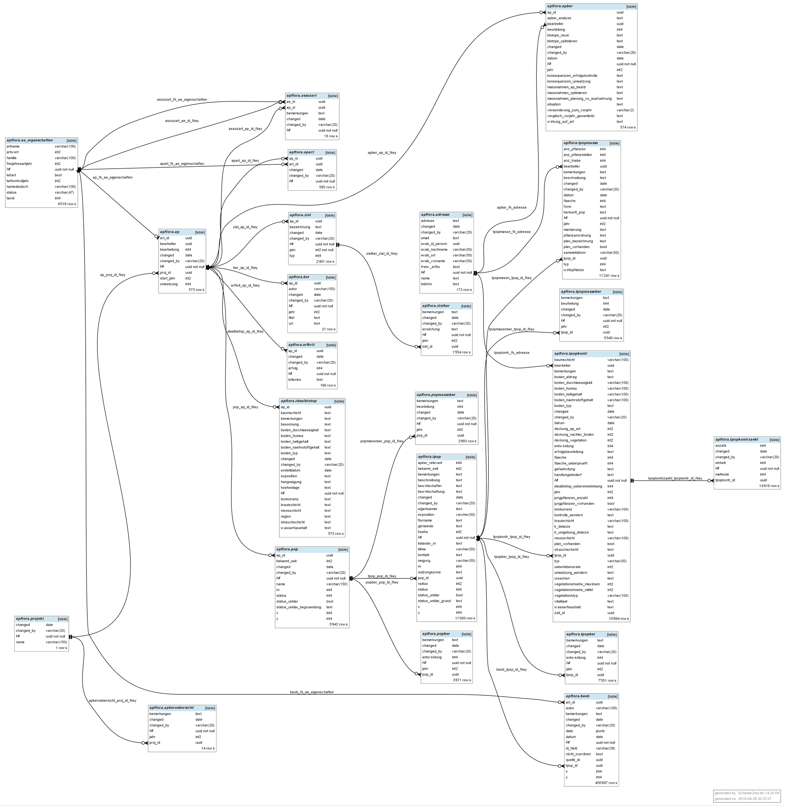

Die Anwendung ist zweigeteilt:

1. Das **Backend** bietet die API (Daten-Schnittstelle) auf [apflora.ch/graphql](//apflora.ch/graphql) an. 
  Es läuft auf einem virtuellen Server mit der jeweils aktuellen Ubuntu LTS Version.
2. Die **App** bzw. das Frontend ist auf [apflora.ch](//apflora.ch) erreichbar. Sie läuft serverless auf [Zeit/now](https://zeit.co/now)

Die wichtigsten verwendeten Technologien sind:

- [Gatsby](//www.gatsbyjs.org): Modernes Werkzeug, um dynamische Apps auf der Grundlage von statischen Dateien zu erzeugen (die wiederum sehr effizient gehostet werden können)
- [GraphQL](https://github.com/facebook/graphql) in Form von [PostGraphile](https://github.com/graphile/postgraphile)
  - API-Server mit einer Zeile bauen und konfigurieren. Das sind _tausende_ weniger als zuvor!
  - Daten-Logik und Rechte-Verwaltung obliegen der Datenbank - wie es sein sollte 
  - GraphQL ist die kommende API-Technologie. Verglichen mit REST ist GraphQL einfach zu verstehen und extrem flexibel. Somit steht ein aussergewöhnlich benutzerfreundlicher API-Server zur Verfügung
- [Apollo](https://www.apollodata.com). Komponenten definieren, welche Daten sie brauchen. GraphQL und Apollo kümmern sich um die Bereitstellung
- [React](//facebook.github.io/react): Deklarative Benutzer-Oberfläche. Aufgebaut aus Komponenten. Verwendet werden ausschliesslich funktionale Komponenten mit "hooks"
- [styled-components](https://github.com/styled-components/styled-components): modular stylen
- [Cypress](https://www.cypress.io): automatisiert testen
- Als Datenbank dient [PostgreSQL](//postgresql.org/). Hier ein [Diagramm der Beziehungen](//raw.githubusercontent.com/barbalex/apf2/master/src/etc/beziehungen.png):
  